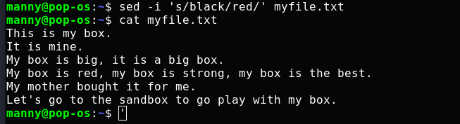

# **Text Substitution with SED**
## **Introduction** 
     

**sed** is a powerful tool that can be used in the Linux terminal to edit text documents without opening them first. The word "sed" is a contraction of the phrase "stream editor", it is esssentially a tool for editing streams of text. **sed** takes in text from a file or text received as the output of another command and lets you perform some operations on it. In this tutorial, I will demonstrate how **sed** can be used to make basic substitutions in text files.  

## **Create a file**
First, open your Linux terminal and navigate to the home directory if you aren't already there. Create a file with the "cat" command in the same way as done below:

## **The basic syntax of SED**

The most common way in which you will use "sed" is this:

    sed ‘s/old_word/new_word/’ FILENAME

You start with typing out “**sed**” which lets the computer know you want to access the stream editor tool, “s” is the search operator that looks through the file. Next, you enter the word you want to substitute out or replace which is the “old_word”, and then the word you want to substitute in which is the “new_word”. Then enter the name of the target file (FILENAME). The forward slash(/) which separates each keyword is called a delimiter, more on this will be explained later. 

Now, following this syntax let's try it out on the file we created above, **myfile.txt.**

    sed ‘s/box/bag/’ myfile.txt  

When you click ENTER, you'll notice that all the first instances of the word “box” on each line have been changed to “bag”.  
You'll also notice that even the word "sandbox" is affected and has been changed to "sandbag", this is because **sed** affects text patterns, not just specified words.

## **Substitute specific instances**

By default, only the first instance of the specified text is altered. If you want to change the order of the affected instance, you type in the following:

    sed ‘s/box/bag/2’ myfile.txt  

  

This ensures that on each line where “box” appears, the first instance is left unaltered and only the second instance changes. You can replace the number “2” with any other number to indicate the particular instance on each line that you want to replace.

## **Substitute all instances**

If you want all instances of the target word on every line to be replaced, enter:

    sed ‘s/box/bag/g’ myfile.txt  

The “g” operator tells the computer you want to replace the word "box" globally, that is, everywhere it occurs in the file.

## **Substitute text without being case-sensitive**
Suppose you want to find and replace a word in a way that does not return an error because of case-sensitivity issues. Perhaps the word occurs in capital letters at some point in the file. The "i" operator is used to resolve this issue and it works like this:

	sed ‘s/BOX/bag/i’ myfile.txt  

This will replace all instances of the word irrespective of the casing of the letters.

## **Substitute text on specific lines**
To find and replace a text pattern on a specific line instead of all the lines, use the following command:

    sed ‘3 s/box/bag/’ myfile.txt  

In the image above, you will see that only the first instance of "box" on the third line has been substituted out. Placing the number "3" before “s” tells the computer that in myfile.txt we want to find and replace the word "box" in the third line only. You can change the number to the number of the line where you want your substitution made.

*Note*: If you have a large file, to display the line numbers, enter this command:  
    
        sed = myfile.txt

## **Substitute text in a range of lines**
To find and replace text in a range of lines:

	sed ‘1,3 s/box/bag/’ myfile.txt  

The first number is followed by the second number and a comma separates them, this lets the computer know that you want your **sed** substitutions made within that range of lines. In this case that is within the range of line 1 to line 3.

## **Make Multiple SED substitutions**
If you want to use the **sed** command multiple times on the same text file, there are various ways for you to do this in one entry in the Linux terminal.
To substitute both the words "box" and "black" with the words "bag" and "red" respectively in the text file we created, **myfile.txt** , we can use any of the following methods:  
    
i. Use pipe (|)

        sed ‘s/box/bag/’ myfile.txt | sed ‘s/black/red/’  

Remember, **sed** can take in output gotten from a previous command and perform some operation on it. In the above scenario, we have piped in output gotten from a previous **sed** command to let us substitute another text in the same file. This lets us make multiple SED substitutions at once.

ii. Use the “-e” option

	    sed -e ‘s/box/bag/’ -e ‘s/black/red/’ myfile.txt  

“-e” is an option provided by **sed** that makes it convenient to make multiple substitutions without needing to call out **sed** each time. You place it right before each command, and it can be used several times.

iii. Use the semicolon(;)

	    sed ‘s/box/bag/;s/black/red/’ song.txt  

The semicolon lets you join all the multiple substitution commands you want to make into one without needing to split them into different groups like the “-e” option requires. It is by far the most convenient, but the -e option will be better in certain situations.

## **Print out only edited lines**
To print out only the lines that you have worked on, perhaps it is a really large file and you want to isolate  the lines you have altered with **sed**, you enter the following command:

	sed -n ‘s/box/bag/p’ myfile.txt  

“-n” is an option that suppresses automatic printing, while the “p” operator causes double printing of the edited lines. The combination of these two will output the edited lines only.

## **Delimiters**
We've been using the forward-slash(/) as a delimiter to separate the relevant categories of our substitution command in the terminal, but sometimes there will be situations where this will not work. For example, if you're trying to use SED on a URL, the URL already has forward slashes (/) and this will cause an error to occur if you try to use a forward-slash(/) as a delimiter. Fortunately, other special characters can be used as delimiters too. Example:

	echo “https://www.wikipedia.org/homepage.html” | sed ‘s$org/homepage$inc/search$’  

Here we use a dollar-sign($) as a delimiter to separate the text we want to substitute out "org/homepage" and the one we want to substitute in "inc/search". If we had tried using the forward-slash(/) as a delimiter, it would have returned an error.

## **Save changes**
At this point, you may have noticed that all the changes we've been making with **sed** are temporary, not permanent. The **myfile.txt** file when opened with the **cat** command is still in its original form, this is by design. To make the changes permanent, you have to pass the “-i” option in this manner:

    sed -i ‘s/black/red/` myfile.txt

Now when you open the file, you will see that the color "black" has been substituted out for "red".  

*Note*: It is not advised to use the “-i” option casually because doing so could cause you to permanently lose your data. Use it only when you are certain you want to make irreversible changes.

## **Save changes to a new file**
If however you want the old file unaltered but want to save your edits to a new file, enter this: 

	sed ‘s/box/bag/g’ myfile.txt > secondfile.txt  

The greater-than(>) sign directs the computer to save the changes from **myfile.txt** to the file **secondfile.txt**, which is automatically created if it did not exist before.   
So when you open **secondfile.txt**, you'll see the following:  

## **Make a backup**
You can also pass a command that tells the computer to permanently edit a file but keep a backup of the original document. To do this, you type out a variation of the “-i” option which is the “-i.bak” option. It is used like this:

    sed -i.bak ‘s/box/bag/g’ myfile.txt

The above lets you make permanent changes but creates a backup of the original file with a “.bak” extension. So the backup created from the command above will be "myfile.txt.bak".

We can see that **myfile.txt** is permanently altered and **myfile.txt.bak** contains its original content
## **Conclusion**
Now you know the different ways of using **sed** to make basic substitutions in text files in the command line, how to make multiple sed changes in one entry, and how to save your changes permanently.
