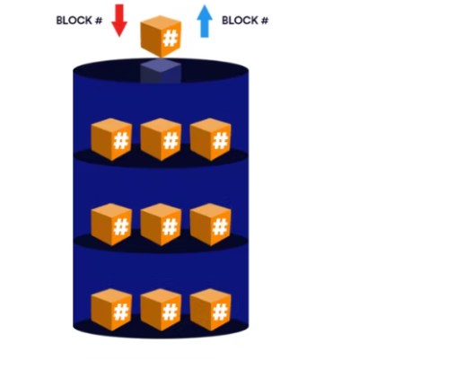

# Understanding Block Storage and Object Storage

### Introduction 
  

In the world of IT, there are different storage solutions available to satisfy the different storage needs businesses have for their data. Let us look at two popular storage solutions, **Block Storage** and **Object Storage**, go over their strengths and weaknesses, and see how they compare to each other.

## Block Storage 
  
Block storage is a traditional storage format wherein data is broken up into pieces and stored inside blocks of fixed equal sizes. These blocks come with unique identifiers and very limited metadata.

The unique identifiers are important because they allow for the blocks to be stored across multiple physical storage devices in a network instead of being stored on just one device. They also make it possible for the blocks to be easily tracked and reassembled when a user wants to access that data.

The software used to provision, divide, and track these blocks (i.e. the software used to manage this storage format) is typically completely separate from the physical storage device(s). These software tools are referred to as block storage management tools. Some examples of them are:  

* Amazon Elastic Block Store (EBS)  
* DigitalOcean Volumes Block Storage
* Serverspace Block Storage
* Vultr Block Storage
* Azure Disk Storage  

Block storage volumes can be attached to a computer locally, connected over a SAN (Storage Area Network) or utilized in a cloud environment. Communication between the computer and the block storage device is usually done via storage protocols like FC (Fibre Channel), FCoE (Fibre Channel over Ethernet), iSCSI (Internet Small Computers System Interface), etc.

Block storage volumes provisioned remotely are configured to be like individual hard drives and are usually accessed at the OS level.

A block storage volume in a cloud environment will typically be decoupled from its server, and this key feature allows you to shut down a server and still retain the data in its storage volume which can then be reattached to another server, all the while incurring zero data loss.

Block storage does not come with built-in resiliency measures but this can be solved by using erasure coding, RAID, etc., to achieve data redundancy, increased performance and other benefits. These measures may be deployed generally or specifically for mission-critical workloads.

### Advantages of Block Storage
1. Block storage volumes are flexible. This means they can be configured to serve a variety of business needs. You can format it with a file system like FAT32, EXT 3, EXT 4, and NTFS. You can set up a database to write straight to your block storage device. You can connect multiple block storage devices to achieve a RAID (Redundant Array of Independent Disks) volume.

2. Boot volumes are block volumes that have been configured to boot an OS for the server they are attached to, and this is a very important feature in the cloud space.

3. Block storage is known for providing consistently high IOPS (Input/Output per Second).

4. Data delivery with reliable low latency is guaranteed with block storage. However, a factor that may affect this is the physical distance between the block storage volume and the application using it, with greater distances leading to higher latency.

5. With block storage, you can make edits to specific data blocks without having to re-upload the entire data file.

6. It allows for simple management of access privileges.

### Disadvantages of Block Storage
1. Block storage is a relatively more costly form of storage. This is because it demands significant investment upfront, along with a highly skilled maintenance staff. 

2. While block storage is highly scalable, when it begins to scale to terabytes and beyond, its complexity also increases, making it harder to locate specific data files.

3. Block storage’s limited metadata capabilities make it impossible to perform advanced search operations.

### Use cases for Block Storage  
1. Transactional databases and relational databases in general require low latency, high IOPs data delivery and the ability to perform incremental updates to data files. Block storage excels in these areas.

2. Mission-critical workloads are often run with block storage because of its high performance and reliably swift data delivery.

3. Virtual machines require boot volumes and general block storage volumes to be able to function.

4. Block storage volumes can be organized into RAID volumes.

5. Block storage is necessary for programs that need server-side processing such as programs written in .NET, Java, etc.

6. Block storage is very instrumental when working with containers because block volumes allow you to preserve a container's data beyond the container’s typical lifespan.

## Object Storage

Object storage is a more recent form of data storage that rose to popularity in the early 2000s because of how well it helped enterprises around the world to store and manage the voluminous amounts of unstructured data being generated as a result of the growing internet. Trillions of data units in a variety of formats are generated on the internet every year and around 80% of that data is unstructured. 

With object storage, each data file is stored wholly inside a distinct object, and these objects, which could number in the millions or even billions, are organized in a flat-file structure (as opposed to a hierarchy) and stored in a single-level repository.  

The abstraction of some of the lower levels of storage is one of the core tenets of object storage. Lower-level storage tasks like creating and managing storage volumes to make the most of disk space or configuring RAID levels to handle disk failure no longer need to be carried out. As a result, rather than accessed as blocks, data is accessed and controlled as objects. An object typically contains:

* A particular data file.
* Metadata which provides the necessary information about the data file in the object.
* A Globally Unique Identifier (GUID)
* Attributes: these provide information about the object itself, information about what users can download the object, delete the object, etc.

A key function of object storage is its customizable metadata. Tthere is no limit to the amount or nature of contextual information about the data that can be added to it. The size of the metadata of a data file can even be larger than the size of the data file itself. This then allows for a more thorough classification and management of the data files which prove important when advanced search and analytics operations need to be undertaken.

These objects are usually accessed via an API (Application Programming Interface) or directly by HTTP(S), they are tracked down by their GUIDs and the data delivery is done by TCP/IP. This ensures that the ease of accessing individual data files remains relatively the same irrespective of the scale of the entire storage space. 

And object storage is highly scalable, you could scale your storage up to even petabytes and beyond while still maintaining data integrity. You scale out simply by adding more nodes to your storage cluster and will usually only be required to pay for the storage space you need.

Object storage has inbuilt resiliency measures to protect your data. Data stored in objects are replicated multiple times and stored across several storage devices, so your data will always be accessible to you even if there is a fault with one or even several of these storage devices. In case of a corruption of one object, you can simply access one of the separately stored copies. This guarantees high availability of your data.

You can also enable object versioning, which is a feature that lets you track many different versions of your data. In the case of accidental deletions or updates, you can simply access the previous versions. Though under normal circumstances, the most important version to your business or project will be the latest version of the object.

### Advantages of Object Storage
1. It provides limitless scalability.

2. Its flat-file structure allows for easy and quick retrieval of data.

3. Its powerful metadata capabilities allow for extensive and detailed search and analytics operations.

4. It comes with inbuilt resiliency protocols to ensure high availability of your data.

5. Object storage is more cost-effective than the other storage solutions on the market.

6. Object storage has the added benefit of abstracting away the maintenance of the underlying physical storage devices.

7. Object storage allows for versioning and its attendant benefits.

### Disadvantages of Object Storage
1. The Objects in object storage are immutable. THis means if you try to make changes to a data file in an object, you would have to re-upload the new file with its changes to a new object. For this reason, it is a terrible choice for storing data that requires consistent updates.

2. Its performance is relatively slower than other storage solutions, this is why it is used mostly for cold storage.

3. Object storage cannot be accessed directly at the OS level without significant degradation in performance.

### Use cases for Object Storage
1. Object storage is extremely useful in the field of big data analytics, this is due to its high scalability and limitless metadata functions.

2. IoT (Internet of Things); object storage is extremely useful for storing and archiving the enormous amounts of unstructured data generated by IoT devices.

3. Object storage makes it easy to store, scale and manage your image files, audio files and other forms of media files with relative ease. It is a popular choice among social media companies, file-sharing sites and streaming services for this very reason.

4. It is extremely useful in disaster recovery plans, this is owing to its inbuilt resiliency protocols.

5. It’s a safe and cost-effective option for storing backups and archived files that will be accessed infrequently. In essence, it’s a great choice for cold storage.

6. Most object storage services can also deliver data to your users publicly, this is why it makes for a great choice when looking to host static websites.

## Block Storage vs Object Storage
Now let’s examine some of the key distinctions between block storage and object storage:  

| Block Storage                                       |                                            Object Storage|
|:----------------------------------------------------|:---------------------------------------------------------|
| Its metadata capabilities are limited.              | Its metadata can be customized extensively.|
| It can only safely scale up to a certain point. | It offers limitless scalability while still retaining accessibility.|
| It is more costly.                                  | It is more cost effective.                               |
| It performs best with operations requiring high IOPS and low latency like relational database storage.| It performs best with large volumes of unstructured data.|
| It can be accessed at the OS level.| It cannot be accessed at the OS level without a significant drop in performance.|
| Block storage requires management and configuration of its volumes.| With object storage the management process is abstracted away by the provider.|
| The distance between the storage location and the application accessing it can affect latency.| The data can be stored across a wide possible range of locations with no effect on latency.|
| Data is broken up into raw blocks and stored in a hierarchical order.| Data is stored whole inside distinct objects organized in a flat-file order.|  
|It allows for incremental edits to files.| Making changes to files in an object would require the creation of a new object.|

## Conclusion
In essence, block storage excels in high performance for frequently accessed, structured data, while object storage shines in scalability and cost-effectiveness for massive archives and unstructured data. Understanding these strengths and the attendant tradeoffs will help you pick the right storage solution for your needs.

